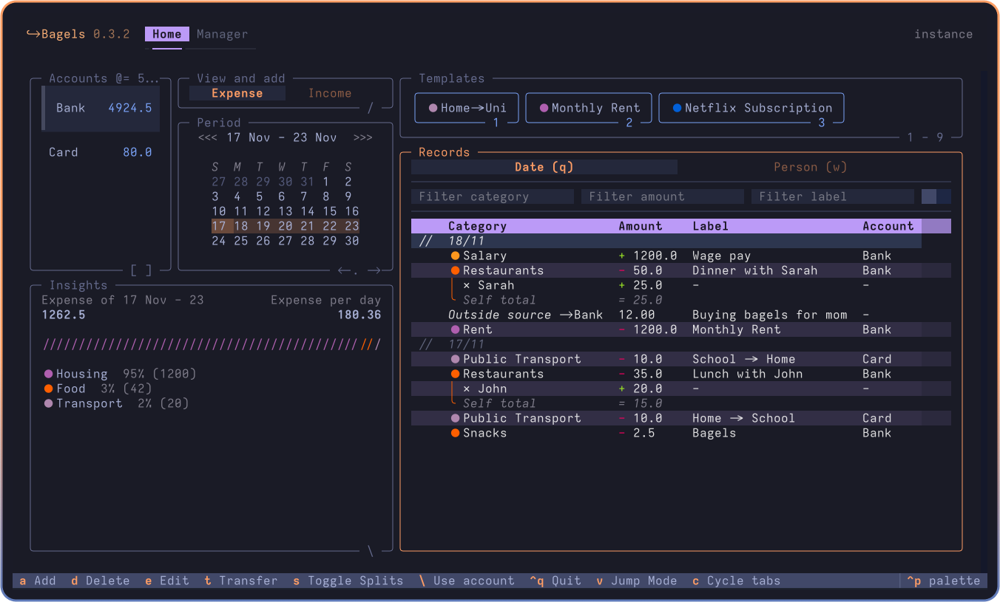
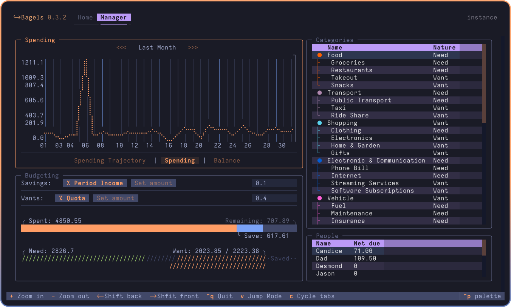

# 🥯 Bagels

A local-first expense tracker with a terminal UI and a scriptable CLI.


<!-- <a title="This tool is Tool of The Week on Terminal Trove, The $HOME of all things in the terminal" href="https://terminaltrove.com/bagels"></a> -->




Bagels keeps your financial data on your machine. Use the interactive terminal app for day-to-day tracking, or use the CLI when you want repeatable commands, scripts, and structured output.

> **Why an expense tracker in the terminal?**
> I found it easier to build a habit and keep an accurate track of my expenses if I do it at the end of the day, instead of on the go. So why not in the terminal where it's fast, and I can keep all my data locally?

## ✨ Features

Some notable features include:

- Accounts, (Sub)Categories, Splits, Transfers, Records
- Templates for Recurring Transactions
- Add Templated Record with Number Keys
- Clear Table Layout with Togglable Splits
- Transfer to and from Outside Tracked Accounts
- "Jump Mode" Navigation
- Less and Less Fields to Enter per Transaction, Powered by Transactions and Input Modes
- Insights
- Customizable Keybindings and Defaults, such as First Day of Week
- Label, amount and category filtering
- Spending plottings / graphs with estimated spendings
- Budgetting tool for saving money and limiting unnecessary spendings

## 🚀 Quick start

### Install the app

The simplest option is `uv`:

```bash
# Install uv if you do not already have it.
curl -LsSf https://astral.sh/uv/install.sh | sh
uv tool install --python 3.13 bagels
```

### Initialize your local data

```bash
bagels init
```

By default, Bagels stores its SQLite database in the platform data directory. To keep a project-local database, pass `--at`:

```bash
mkdir -p ./bagels-data
bagels --at ./bagels-data init
```

### Add your first records

```bash
bagels accounts list
bagels categories list
bagels records add --help
bagels records list
```

For a guided interactive session, run:

```bash
bagels
```

Useful reports:

```bash
bagels summary
bagels spending
bagels trends
bagels llm context
```

Every query command supports structured output where applicable:

```bash
bagels summary --format json
bagels records list --format yaml
```

See [`SKILL.md`](SKILL.md) for the complete command reference.

## 🤖 Install the agent skill

Bagels includes a skill for coding agents that need to work with the finance CLI. Install it directly from this repository with:

```bash
npx skills@latest add thepbordin/bagels
```

To install it for every supported agent without prompts:

```bash
npx skills@latest add thepbordin/bagels --all
```

The skill is named `bagels-finance` and is defined in [`SKILL.md`](SKILL.md).

## ↔️ Migration

Please read the [migration guide](MIGRATION.md) for migration from other services.

## 🧑‍💻 Run from source

```bash
git clone https://github.com/thepbordin/Bagels.git
cd Bagels
uv sync
uv run bagels init
uv run bagels --help
```

## 🗺️ Roadmap

- [x] Budgets (Major!)
- [x] More insight displays and analysis (by nature etc.)
- [ ] Daily check-ins
- [ ] Pagination for records on monthly and yearly views.
- [ ] Importing from various formats

Backlog:

- [ ] "Processing" bool on records for transactions in process
- [ ] Record flags for future insights implementation
- [ ] Code review
- [ ] Repayment reminders
- [ ] Add tests
- [ ] Bank sync

## Attributions

- Heavily inspired by [posting](https://posting.sh/)
- Bagels is built with [textual](https://textual.textualize.io/)
- It's called bagels because I like bagels
