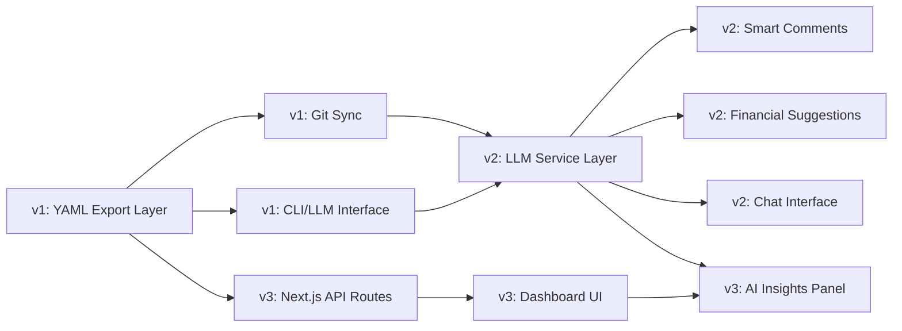

# 🥯 Bagels — Feature Roadmap

> Evolving Bagels from a TUI expense tracker into a Git-synced, AI-powered, cross-platform personal finance system.

---

## Current State

Bagels is a **Python 3.13 TUI expense tracker** built on **Textual** with a **SQLAlchemy/SQLite** backend. Data is stored as a binary `.db` file at `~/.local/share/bagels/db.db`, which is **not human-readable and not Git-friendly**.

**Current data models:** Account, Category (Want/Need/Must), Record, Split, Person, RecordTemplate

**Current storage:** SQLite binary database — impossible to diff, merge, or version control meaningfully.

---

## v1 — Git-Trackable Data & LLM Data Access

### 🎯 Goal

Make all expense data **Git-trackable**, enable **Git-based backup/sync**, and expose data to **LLM via a clean text-based CLI interface**.

---

### 1.1 Git-Trackable Expense Data

> [!IMPORTANT]
> This is the foundational change — all other features depend on a human-readable, diffable data format.

#### Problem

The current SQLite binary `.db` file cannot be meaningfully diffed, merged, or tracked in Git. Every change produces an opaque binary diff.

#### Proposed Solution — Dual-Storage Architecture

Keep SQLite as the  runtime engine but add a **YAML/JSON export layer** that is the canonical Git-tracked source of truth.

```
~/.local/share/bagels/
├── db.db                    # Runtime SQLite (gitignored)
├── data/                    # Git-tracked canonical data
│   ├── accounts.yaml
│   ├── categories.yaml
│   ├── persons.yaml
│   ├── templates.yaml
│   └── records/
│       ├── 2026-01.yaml     # Records grouped by month
│       ├── 2026-02.yaml
│       └── 2026-03.yaml
├── .gitignore               # Ignores db.db, keeps data/
└── config.yaml              # Already exists
```

#### Data Format

Each entity exports to a **human-readable, diffable YAML** format:

```yaml
# data/records/2026-03.yaml
records:
  - id: "r_2026-03-14_001"
    date: "2026-03-14"
    label: "Lunch at Sukiya"
    amount: 189.00
    account: "kasikorn_checking"
    category: "food/dining_out"
    nature: "want"
    is_income: false
    splits:
      - person: "fu"
        amount: 94.50
        is_paid: true
        paid_date: "2026-03-14"
    tags: ["food", "japanese"]
```

#### Key Design Decisions

| Decision | Choice | Rationale |
|---|---|---|
| Format | YAML | Human-readable, good Git diffs, compact |
| Record grouping | By month | Keeps files manageable, natural expense boundary |
| IDs | Slug-based (`r_2026-03-14_001`) | Stable, human-readable, mergeable |
| Sync direction | Bidirectional | YAML → SQLite on load, SQLite → YAML on save |
| Conflict resolution | Last-write-wins with Git merge markers | Let Git handle conflicts naturally |

#### Implementation

- **`DataExporter`** — Serializes SQLAlchemy models → YAML files
- **`DataImporter`** — Reads YAML files → hydrates SQLite database
- **Auto-sync hooks** — Export on every record save/update/delete
- **CLI command** — `bagels export` and `bagels import` for manual sync
- **`bagels init`** — Initializes a new data directory with Git repo

---

### 1.2 Git Sync & Data Backup

#### Commands

```bash
bagels git init              # Initialize data/ as a git repo
bagels git sync              # Auto-commit + push changes
bagels git pull              # Pull remote changes and reimport
bagels git status            # Show uncommitted data changes
bagels git log               # Show recent data history
```

#### Auto-Sync Behavior

```
User saves record → SQLite write → YAML export → Git auto-commit
                                                  ↓
                              "[bagels] +2 records, -1 record (2026-03-14)"
```

- **Auto-commit** on each save with descriptive messages
- **Optional auto-push** to remote (configurable)
- **On startup** — pull remote → import YAML → sync SQLite
- **Conflict handling** — preserve both sides with `.conflict` marker files

#### Config Addition

```yaml
# config.yaml
git:
  enabled: true
  auto_commit: true
  auto_push: false
  remote: "origin"
  branch: "main"
  commit_message_format: "[bagels] {summary}"
```

---

### 1.3 LLM Data Access — Text-Only CLI Interface

> [!TIP]
> The CLI acts as both a **standalone tool** and an **LLM-friendly interface**. Output is structured, parseable, and self-documenting.

#### Design Philosophy

- Every output is **well-formatted text** that an LLM can parse
- Every command returns **structured, consistent output**
- Supports **both human-readable and machine-readable** formats
- **No interactive prompts** in query mode — pure stdin/stdout

#### CLI Commands

```bash
# Data querying
bagels query records --month 2026-03 --format table
bagels query records --category food --from 2026-01-01 --to 2026-03-14 --format json
bagels query summary --month 2026-03
bagels query accounts --format yaml
bagels query categories --tree

# Data overview
bagels query spending --by category --month 2026-03
bagels query spending --by day --month 2026-03
bagels query trends --months 6 --category food

# Data mutation (for LLM-driven workflows)
bagels add record --label "Coffee" --amount 65 --account kasikorn --category food/coffee
bagels add record --from-yaml /path/to/record.yaml

# Schema / metadata
bagels schema                # Print full data schema for LLM context
bagels schema records        # Print record schema
```

#### Output Formats

```bash
# Table format (default, human-readable)
$ bagels query records --month 2026-03 --limit 5

┌────────────┬──────────────────────┬──────────┬─────────────┬────────┐
│ Date       │ Label                │ Amount   │ Category    │ Type   │
├────────────┼──────────────────────┼──────────┼─────────────┼────────┤
│ 2026-03-14 │ Lunch at Sukiya      │  -189.00 │ food/dining │ expense│
│ 2026-03-14 │ BTS Top-up           │   -50.00 │ transport   │ expense│
│ 2026-03-13 │ Freelance payment    │ +5000.00 │ income/work │ income │
└────────────┴──────────────────────┴──────────┴─────────────┴────────┘

# JSON format (machine-readable, LLM-friendly)
$ bagels query summary --month 2026-03 --format json

{
  "month": "2026-03",
  "total_income": 45000.00,
  "total_expenses": 18750.00,
  "net": 26250.00,
  "by_nature": { "want": 6200, "need": 10500, "must": 2050 },
  "by_category": { "food": 4500, "transport": 1200, ... },
  "top_expenses": [
    { "label": "Rent", "amount": 8500, "category": "housing" }
  ]
}
```

#### LLM Integration Hook

A special `bagels context` command that dumps all relevant info in one shot:

```bash
$ bagels context --month 2026-03

# Bagels Financial Context — March 2026

## Accounts
- Kasikorn Checking: ฿ 42,350.00
- SCB Savings: ฿ 150,000.00

## This Month Summary
- Income: ฿ 45,000.00
- Expenses: ฿ 18,750.00
- Savings Rate: 58.3%

## Spending by Category
- 🏠 Housing (Must): ฿ 8,500 (45.3%)
- 🍜 Food (Want): ฿ 4,500 (24.0%)
- 🚇 Transport (Need): ฿ 1,200 (6.4%)
...

## Recent Records (last 10)
| Date | Label | Amount | Category |
|------|-------|--------|----------|
| ... | ... | ... | ... |

## Budget Status
- Food: ฿ 4,500 / ฿ 6,000 (75.0%) ██████████░░░░
- Transport: ฿ 1,200 / ฿ 2,000 (60.0%) ████████░░░░░░
```

---

## v2 — LLM-Integrated Financial Intelligence

### 🎯 Goal

Integrate LLM capabilities directly into the Bagels workflow for **automated expense commentary**, **spending analysis**, and **personalized financial suggestions**.

---

### 2.1 Architecture

```
┌──────────────────────────────────────────────────┐
│                  Bagels TUI / CLI                │
│                                                  │
│  ┌──────────────┐  ┌─────────────────────────┐   │
│  │ Record Form  │  │  Insights / Analysis    │   │
│  │              │  │                         │   │
│  │ [AI Comment] │  │  [AI Suggestions]       │   │
│  │ [Auto-Cat]   │  │  [Spending Patterns]    │   │
│  └──────┬───────┘  └──────────┬──────────────┘   │
│         │                     │                  │
│  ┌──────▼─────────────────────▼──────────────┐   │
│  │           LLM Service Layer               │   │
│  │                                           │   │
│  │  • Provider-agnostic (OpenAI / Ollama)    │   │
│  │  • Prompt template engine                 │   │
│  │  • Response caching & rate limiting       │   │
│  │  • Context builder from bagels data       │   │
│  └──────────────┬────────────────────────────┘   │
│                 │                                │
│  ┌──────────────▼────────────────────────────┐   │
│  │         Data Layer (YAML + SQLite)        │   │
│  └───────────────────────────────────────────┘   │
└──────────────────────────────────────────────────┘
```

### 2.2 LLM Provider Configuration

```yaml
# config.yaml
llm:
  enabled: true
  provider: "openai"           # openai | ollama | anthropic
  model: "gpt-4o-mini"         # or "llama3.2" for Ollama
  api_key_env: "BAGELS_LLM_KEY"
  base_url: null               # custom endpoint for Ollama
  features:
    auto_comment: true
    auto_categorize: true
    spending_analysis: true
    financial_suggestions: true
  cache:
    enabled: true
    ttl_hours: 24
```

### 2.3 Feature: Smart Expense Comments

When a user adds a record, the LLM can **auto-generate a comment** based on context:

```
User adds: "Sukiya" → ¥189

AI Comment: "Mid-range Japanese chain dining. This is your 3rd dining
out expense this week (total: ฿587). You're at 78% of your monthly
food budget."
```

**Stored as a new `ai_comment` field on the Record model.**

### 2.4 Feature: Auto-Categorization

LLM suggests a category based on the label and amount:

```
User types: "Grab to Siam"
→ AI suggests: Category: transport/rideshare (confidence: 95%)
→ User confirms with single keypress
```

### 2.5 Feature: Financial Suggestions

Available via CLI and TUI insights panel:

```bash
$ bagels suggest

🤖 Bagels AI — Financial Insights for March 2026
━━━━━━━━━━━━━━━━━━━━━━━━━━━━━━━━━━━━━━━━━━━━━━━━

💡 Spending Pattern Detected
   Your dining expenses increased 23% vs last month. Your top
   restaurant is Sukiya (5 visits, ฿945 total). Consider meal
   prepping 2x/week to save ~฿600/month.

⚠️  Budget Alert
   Food budget at 78% with 16 days remaining. At current pace,
   you'll exceed by ฿1,200. Suggested daily limit: ฿180.

📈 Savings Opportunity
   You spent ฿3,200 on "Want" items vs ฿2,100 last month.
   Biggest increase: entertainment (+฿800). Your 3-month average
   for entertainment is ฿1,500.

✅ Positive Trends
   Transport spending down 15% — great job using BTS more!
   Consistent savings rate above 50% for 3 months straight.
```

### 2.6 Feature: Conversational Finance Chat

```bash
$ bagels chat

🥯 Bagels AI Chat
Type 'quit' to exit. I have access to all your financial data.

You: How much did I spend on food this month compared to last month?

AI: This month (March 2026) you've spent ฿4,500 on food so far,
    compared to ฿5,800 for all of February. Here's the breakdown:

    Category        Mar (so far)   Feb (total)   Change
    ─────────────   ────────────   ───────────   ──────
    Dining Out         ฿2,800         ฿3,200     -12.5%
    Groceries          ฿1,200         ฿1,800     -33.3%
    Coffee/Drinks        ฿500           ฿800     -37.5%

    You're trending 22% lower than last month. Keep it up! 🎉

You: What's my biggest unnecessary expense?

AI: Based on "Want" nature categorization, your top discretionary
    expenses this month are:
    1. Entertainment — ฿2,300 (gaming subscriptions + movie tickets)
    2. Dining Out — ฿2,800 (could shift some to groceries)
    3. Shopping — ฿1,100 (clothing + accessories)

    Recommendation: Your gaming subscriptions (฿890/mo) include 2
    services you haven't used in the past 30 days. Consider pausing
    them to save ฿490/month.
```

---

## v3 — Next.js Web Interface

### 🎯 Goal

Build a **modern, fully-responsive web dashboard** using **Next.js + HeroUI + React Bits**, inspired by the **offix.tech** clean dark-mode aesthetic.

---

### 3.1 Design Direction

**Reference:** [offix.tech](https://offix.tech) — clean, minimal, premium dark mode

| Design Element | Approach |
|---|---|
| **Theme** | Dark mode primary, soft glow accents |
| **Typography** | Inter / Geist — clean sans-serif |
| **Colors** | Deep navy/charcoal bg, cyan/purple accent gradients |
| **Layout** | Glassmorphism cards, generous whitespace |
| **Animations** | Framer Motion — smooth page transitions, micro-interactions |
| **Responsive** | Mobile-first, breakpoints at 640/768/1024/1280px |
| **Components** | HeroUI base + React Bits for creative effects |

### 3.2 Tech Stack

```
Framework:      Next.js 15 (App Router)
UI Library:     HeroUI (formerly NextUI)
Animations:     Framer Motion + React Bits
Styling:        Tailwind CSS (HeroUI dependency)
Charts:         Recharts or Tremor
State:          Zustand
API:            Next.js API routes → reads Bagels YAML data
Auth:           Optional — local-only by default
Deployment:     Vercel / Self-hosted
```

### 3.3 Pages & Layout

```
/                       → Dashboard (overview, quick stats, recent records)
/records                → Full records table with filters & search
/records/new            → Add new record (with AI suggestions)
/insights               → Spending analytics, charts, trends
/insights/ai            → AI-powered financial analysis
/budgets                → Budget overview and progress
/accounts               → Account management
/settings               → App settings, LLM config, Git sync status
```

### 3.4 Dashboard Design

```
┌─────────────────────────────────────────────────────────────┐
│  🥯 Bagels                    March 2026    [◑ Dark Mode]   │
├─────────────────────────────────────────────────────────────┤
│                                                             │
│  ┌──────────┐  ┌──────────┐  ┌──────────┐  ┌──────────┐    │
│  │ Income   │  │ Expenses │  │ Net      │  │ Savings  │    │
│  │ ฿45,000  │  │ ฿18,750  │  │ ฿26,250  │  │ 58.3%   │    │
│  │ ↑ 5.2%   │  │ ↓ 3.1%   │  │ ↑ 8.4%   │  │ ↑ 2.1%  │    │
│  └──────────┘  └──────────┘  └──────────┘  └──────────┘    │
│                                                             │
│  ┌──────────────────────────┐ ┌────────────────────────┐    │
│  │   Spending by Category   │ │   Monthly Trend Line   │    │
│  │                          │ │                        │    │
│  │   ██████████ Food 24%    │ │   ╭──╮    ╭──╮        │    │
│  │   ███████ Transport 16%  │ │ ──╯  ╰────╯  ╰──      │    │
│  │   ████████████ Rent 45%  │ │   Jan Feb Mar Apr      │    │
│  │   ████ Other 15%         │ │                        │    │
│  └──────────────────────────┘ └────────────────────────┘    │
│                                                             │
│  ┌──────────────────────────────────────────────────────┐   │
│  │   Recent Records                          [+ Add]    │   │
│  │                                                      │   │
│  │   Today                                              │   │
│  │   🍜 Lunch at Sukiya        -฿189    food/dining     │   │
│  │   🚇 BTS Top-up             -฿50     transport       │   │
│  │                                                      │   │
│  │   Yesterday                                          │   │
│  │   💰 Freelance payment     +฿5,000   income/work     │   │
│  │   🛒 Big C Groceries       -฿890     food/groceries  │   │
│  └──────────────────────────────────────────────────────┘   │
│                                                             │
│  ┌──────────────────────────────────────────────────────┐   │
│  │   🤖 AI Insights                                     │   │
│  │                                                      │   │
│  │   "Your food spending is trending 22% lower than     │   │
│  │    last month. Great progress on your budget!"       │   │
│  │                                                      │   │
│  │   [View Full Analysis →]                             │   │
│  └──────────────────────────────────────────────────────┘   │
└─────────────────────────────────────────────────────────────┘
```

### 3.5 Key UI Components

| Component | Source | Usage |
|---|---|---|
| Cards & Modals | HeroUI | Dashboard stats, record details |
| Data Tables | HeroUI Table | Records list, budget overview |
| Charts | Recharts | Spending trends, category breakdown |
| Date Picker | HeroUI | Date range filters |
| Toast / Notifications | HeroUI | Save confirmations, AI insights |
| Animated Backgrounds | React Bits | Hero sections, loading states |
| Number Tickers | React Bits | Stat counters on dashboard |
| Gradient Text | React Bits | Headers, accent elements |
| Sparklines | Custom | Inline trend indicators |

### 3.6 Responsive Breakpoints

| Breakpoint | Layout |
|---|---|
| `< 640px` (Mobile) | Single column, bottom nav, swipeable cards |
| `640–1024px` (Tablet) | 2-column grid, collapsible sidebar |
| `> 1024px` (Desktop) | Full sidebar + 3-column dashboard grid |

### 3.7 Data Flow — Web ↔ Bagels

```
┌─────────────┐    reads     ┌─────────────────┐
│  Next.js    │ ──────────→  │  YAML Data      │
│  API Routes │              │  (Git-tracked)   │
│             │  ←────────── │                  │
│             │    writes     │  data/*.yaml    │
└──────┬──────┘              └────────┬────────┘
       │                              │
       │  serves                      │  syncs
       ▼                              ▼
┌─────────────┐              ┌─────────────────┐
│  Browser    │              │  Git Remote     │
│  Dashboard  │              │  (Backup)       │
└─────────────┘              └─────────────────┘
```

The web interface reads/writes the same **YAML data files** that the TUI uses, meaning:
- **Single source of truth** — both interfaces share the same data
- **Git sync works for both** — commit from either TUI or web
- **Offline-first** — web can work with local YAML files

---

## Version Dependencies



---

## Implementation Priority

### v1 — Foundation (Estimated: 2–3 weeks)

| # | Task | Priority | Effort |
|---|---|---|---|
| 1 | YAML data schema design | 🔴 Critical | Medium |
| 2 | `DataExporter` (SQLite → YAML) | 🔴 Critical | Medium |
| 3 | `DataImporter` (YAML → SQLite) | 🔴 Critical | Medium |
| 4 | Auto-sync hooks in managers | 🔴 Critical | Small |
| 5 | `bagels git` CLI commands | 🟡 High | Medium |
| 6 | `bagels query` CLI commands | 🟡 High | Large |
| 7 | `bagels context` LLM dump | 🟢 Medium | Small |
| 8 | `bagels schema` command | 🟢 Medium | Small |

### v2 — Intelligence (Estimated: 2–3 weeks)

| # | Task | Priority | Effort |
|---|---|---|---|
| 1 | LLM service layer + provider abstraction | 🔴 Critical | Large |
| 2 | Prompt template engine | 🔴 Critical | Medium |
| 3 | Auto-categorization | 🟡 High | Medium |
| 4 | Smart expense comments | 🟡 High | Medium |
| 5 | `bagels suggest` command | 🟡 High | Medium |
| 6 | `bagels chat` interactive mode | 🟢 Medium | Large |
| 7 | Response caching layer | 🟢 Medium | Small |
| 8 | TUI integration (insights panel) | 🟢 Medium | Medium |

### v3 — Web Interface (Estimated: 4–6 weeks)

| # | Task | Priority | Effort |
|---|---|---|---|
| 1 | Next.js project setup + HeroUI + Tailwind | 🔴 Critical | Small |
| 2 | YAML data reader API routes | 🔴 Critical | Medium |
| 3 | Dashboard page + stat cards | 🔴 Critical | Large |
| 4 | Records table + CRUD | 🟡 High | Large |
| 5 | Insights/charts page | 🟡 High | Large |
| 6 | Budget management page | 🟡 High | Medium |
| 7 | AI insights panel | 🟢 Medium | Medium |
| 8 | Account management page | 🟢 Medium | Medium |
| 9 | Settings + Git sync status | 🟢 Medium | Small |
| 10 | Mobile responsive polish | 🟡 High | Medium |
| 11 | Dark mode + animations polish | 🟡 High | Medium |

---

## Documentation Policy

> [!IMPORTANT]
> **Always update docs after changes.** Every PR / feature implementation must include updates to relevant documentation.

### Docs to maintain

| Document | Location | Updates when... |
|---|---|---|
| `README.md` | Root | New features, CLI commands, setup changes |
| `FEATURE_ROADMAP.md` | `docs/` | Task completion, scope changes |
| `CHANGELOG.md` | Root | Every release / significant change |
| `API.md` | `docs/` | New CLI commands or API routes (create in v1) |
| `.planning/codebase/*.md` | `.planning/` | Architecture or stack changes |
| `MIGRATION.md` | Root | New data format migration steps |

### Documentation checklist (per feature)

- [ ] Update `FEATURE_ROADMAP.md` — mark task as complete
- [ ] Update `README.md` if user-facing
- [ ] Update `CHANGELOG.md` with summary
- [ ] Add/update inline code comments
- [ ] Update `.planning/` docs if architecture changed

---

*Last updated: 2026-03-14*
